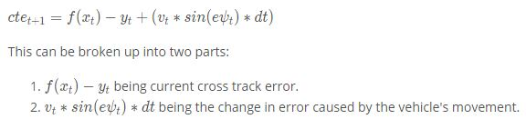

# CarND-Controls-MPC
Self-Driving Car Engineer Nanodegree Program

## Model Predictive Controller

MPC is a non-linear system which generates optimized parameters with the constraint of obtaining minimal value of cost function. Here, cost function refers to the problem built by taking into consideration the model of the system, range of inputs, limitations on outputs and/or the effect of external factors acting on the system.

A typical cost function in case of a self-driving vehicle will have following constraints:
1. The cross track error (cte), i.e. the distance of vehicle from the center of the lane must be minimal.
2. The heading direction of the vehicle must be close to perpendicular to the lane. Error PSI (epsi) is the error in heading direction.
3. Oscillations while riding the vehicle must be minimal. This takes into account the change in heading direction due to turns and also the change in speed due to acceleration/braking. 
4. The vehicle must drive safely and should not exceed the speed limit. In contrast, the vehicle must also not drive too slow as one wouldn't reach any place.

These constraints are merged to form a cost function. MPC tries to reduce the cost function and come up with the values of actuation inputs to the vehicle, which can be the steering angle of the wheel and/or the throttle/brake magnitude.

## Goal
In this project, MPC was implemented to drive a car around a circular track having sharp left and right turns. A good solution would help the car stay in the center portion of the lane and take smooth left and right turns without touching or running over the edges of the lane (considered as risky in case humans were travelling in such a car). Also, the final implementation had to be tested with speeds as high as 80-100mph and note down the behavior of the car.

## Project Implementation
Simulation of a circular track was achieved in the Udacity's self driving car simulator. While MPC was implmented in C++, the simulator communicated to C++ code with the help of uWebSockets library. Following parameters were received from the simulator for each communication:

1. List of waypoints with x and y coordinates of each point in global map system. These waypoints represent the suggested trajectory for the car from current position to few distance ahead of it. Such type of information is usually received from a Path Planning Module implemented in self-driving vehicles. The path planning module generates reference trajectory for a section of the total journey based on the current location of the vehicle.
2. The current position and heading of car in global map system.
3. The current steering angle and throttle applied to the car.
4. The current speed of the car.

The final implementation consisted of following major steps:

#### 1. Align of data relative to the motion of car:
In this step, the coordinates of waypoints were transformed from global map system to vehicle's coordinate system. This was done to ensure the calculations of cte and epsi were less complex and involved less calculations. An overview of global map coordinate system and local vehicle system coordinate system is shown below:
    

#### 2. Generation of reference trajectory from waypoints:
The transformed coordinates of waypoints were then used to create a smooth curved trajectory, which will act as a reference for motion of the car. This is done by using polynomial fitting or regression technique. In this technique, discrete points are fitted to a polynomial of desired degree in order to obtain the relation function between x and y coordinates, also known as the curve equation. In this project, the waypoints coordinates were fitted to a 3rd degree polynomial. A smooth curve was drawn inside the scene in the simulator shown by yellow line in the screen cap below:

#### 3. Calculation of CTE and EPSI:
As a result of transformation of data in step 1, the calculation of cte was a linear function and the calculation of epsi involved taking arctangent of the first order coefficient of fitting polynomial. The formulae are given below:
    

#### 4. Definition of motion model, control/actuator inputs and state update equations:

The motion model in this project was based on the Kinematic equations of motion in 2 dimensions.

The actuator inputs used to control the car are given below: 
1. The magnitude of steering (delta). This was limited to [-25, 25] as per the angle specification of simulator. 
2. The magnitude of throttle (a). This was limited to [-1, 1] as per the throttle/brake specification of simulator.

#### 5. Definition of time step length (N) and duration between time steps (dt):
 Higher value of N ensures more number of estimates while higher value of dt ensures the estimates are closer in time. Different combinations are tried to achieve Na dn dt value mentioned below:

N and dt                                 Observation
1. N=10,dt=0.1,                               At turns car took sharp turns, due to less number of dicrete points.
2. N=7,dt=0.07,                               Perfect combination for car movement for the track provided to complete this project.  This configuration works well till 90MPH and moderate execution with 100MPH.

After trial and error, N=7 and dt=0.07 means MPC algorithm predicts future for (7*.07 = 500ms) and it is drawn inside simulator with Green color.

#### 6. Definition of desired behavior and actuator constraints:
In order to define the cost function of the system, it was essential to list down the desired values of different parameters. They are given below:

1. Expected value of CTE to be zero
2. Expect value of EPSI to be zero
3. Maximum speed of the car to be in between 80-100mph. This was a tunable parameter and the goal was to test the maximum speed at which the car stays on the track and moves safely.

#### 7. Definition of cost function for MPC:
Key elements and features of the cost function are given below:

1. Highest weight for calculated CTE and EPSI. This was to ensure the car stays in the middle of lane and head in desired direction.
2. Reduce high initial values of control inputs (delta and a) to ensure there is no jerk in motion of the car.
3. Minimize the change in values of control inputs (delta and a) in order to minimize oscillations in the motion
4. Minimize speeds at higher steering angle and minimize steering at higher speeds.

#### 8. Incorporating effect of latency in the control actuations:
Simulator introduces latency of 100ms. This delay caused control actuations to reach the car in later of time.This will work fine for low speed but resulted in undesired behavior at high speeds.
To account latency effect, the state parameter for next state were calculated beforehand and were sent to MPC for generating steering and throttle values(i.e. Predictnextstate() function is implemented for this).This ensured the actuations applied at current point of time were actually for the next time step (i.e. after 100 ms).

## Project Output
MPC used to derive the steering angles and throttle/brake for a car moving on a circular track was implemented successfully. Output video is attached named "Output_video.mp4". The ouptut video i atatched with 80mph but the solution works well till 90mph.
